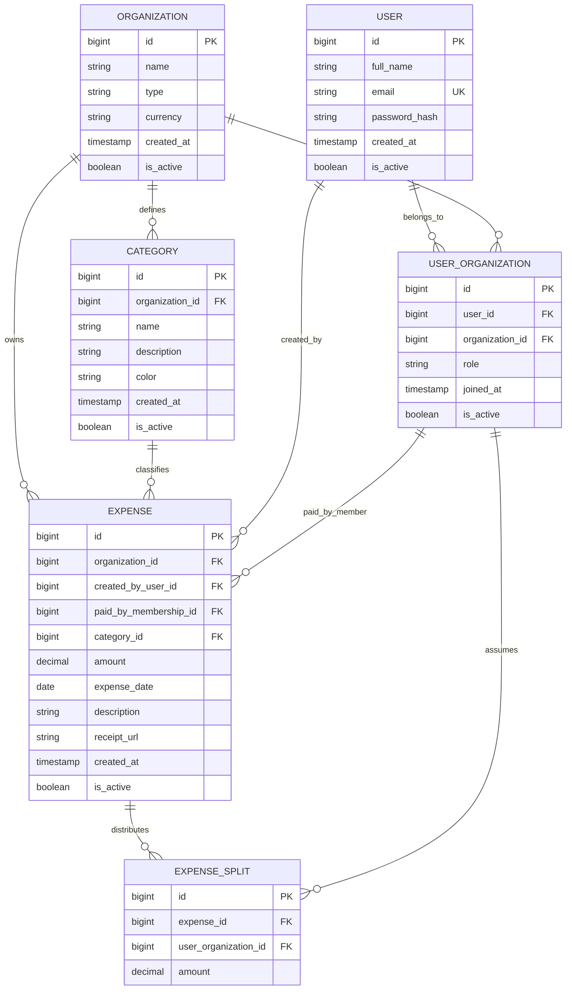

# 📊 Shareverance - Sistema de Gestión de Gastos Organizacionales

Sistema multi-tenant para la centralización, división, gestión y análisis predictivo de gastos aplicable a consorcios, universidades y hogares.

**Alcance MVP simplificado:**
- Registro y gestión de múltiples organizaciones.
- Usuarios con roles (`ADMIN` o `USER`) asignados por organización.
- Registro de gastos indicando fecha, importe, descripción, categoría y con quiénes se reparte (individual, con otro usuario, con varios o con todos).
- Un `ADMIN` puede cargar gastos en nombre de otro usuario de su organización.
- Análisis y proyecciones mensuales de gastos mediante el servicio predictivo.

Las reglas de negocio detalladas se documentan en [Reglas de negocio](REGLAS_DE_NEGOCIO.md).

---

## 🛠️ Stack Tecnológico
* **Frontend:** React / TypeScript
* **Backend Transaccional:** Java (Spring Boot)
* **Microservicio Predictivo:** Python (FastAPI/Flask)
* **Base de Datos:** PostgreSQL

---

## Inicio rápido

Requisitos: Git y Docker Desktop iniciado, con contenedores Linux y Docker Compose 2.20 o posterior. En Windows se usa WSL 2. No es necesario instalar Java, Python, Node.js o PostgreSQL por separado. La primera ejecución necesita Internet para descargar imágenes y dependencias.

Los comandos siguientes se ejecutan en PowerShell.

### 1. Clonar el repositorio

```powershell
git clone https://github.com/seba615/shareverance shareverance
Set-Location shareverance
```
Si el entorno todavía está en una rama pendiente de integración, seleccionar esa rama antes de continuar: `git switch --track origin/NOMBRE_RAMA`. 

### 2. Crear la configuración local

```powershell
Copy-Item .env.example .env
```

Revisar las credenciales de `.env`. Este archivo es personal y no se sube a Git. Para el acceso directo a los servicios, si tienen algun puerto ocupado agregar a .env:

```dotenv
POSTGRES_HOST_PORT=5433
JAVA_HOST_PORT=8080
PYTHON_HOST_PORT=8000
```
Los puertos son de referencia, verificar cuales están libres en entorno local. 

### 3. Construir e iniciar

Desde la raíz del repositorio:

```powershell
docker compose -f compose.yaml -f compose.tools.yaml up --build -d --wait --wait-timeout 300
docker compose -f compose.yaml -f compose.tools.yaml ps
```

Los servicios deben aparecer como `healthy`. Las migraciones y los datos de demostración se cargan automáticamente; no crear tablas manualmente.

### 4. Comprobar el entorno

Abrir [http://localhost:5173](http://localhost:5173) y pulsar **Verificar conexiones**. Se espera `java: UP`, `database: UP`, `python: UP` y `demoRows: 2`.

Python queda disponible en [http://localhost:8000/docs](http://localhost:8000/docs). 

## Documentación

- [Guía de desarrollo y mantenimiento](docs/GUIA_DESARROLLO.md): actualización, ramas, servicios y agregado de bibliotecas.
- [Como se creó el entorno](docs/ENTORNO_INICIAL.md): cómo se creó la configuración y para qué sirve cada archivo.
- [Reglas de negocio](docs/REGLAS_DE_NEGOCIO.md): decisiones y temas pendientes.

---

## 📐 Modelo de Datos (DER)


El DER muestra exclusivamente las entidades indispensables para la gestión y división de gastos del MVP.

---

# Detalle de Entidades y Atributos

## 1. ORGANIZATION

Representa el grupo global o **tenant** del sistema (por ejemplo: consorcio, universidad o familia).

| Atributo | Tipo | Restricciones / Descripción |
|---|---|---|
| `id` | BIGINT | **PK**, Auto-increment. Identificador único. |
| `name` | VARCHAR(100) | Nombre de la entidad. Ej.: `"Edificio Central"`, `"Hogar Pérez"`. |
| `type` | VARCHAR(50) | Clasificación del dominio: `HOUSEHOLD`, `CONDO`, `UNIVERSITY`. |
| `currency` | CHAR(3) | Moneda de la organización (por defecto `ARS`). |
| `created_at` | TIMESTAMP | Fecha de alta de la organización. |
| `is_active` | BOOLEAN | Estado de la organización. Default: `true`. |

---

## 2. USER

Representa las cuentas y credenciales de los usuarios en la plataforma.

| Atributo | Tipo | Restricciones / Descripción |
|---|---|---|
| `id` | BIGINT | **PK**, Auto-increment. Identificador único. |
| `full_name` | VARCHAR(100) | Nombre completo del usuario. |
| `email` | VARCHAR(150) | Correo único para autenticación. **Unique**. |
| `password_hash` | VARCHAR(255) | Hash seguro de la contraseña. |
| `created_at` | TIMESTAMP | Fecha de registro. |
| `is_active` | BOOLEAN | Estado de la cuenta global. Default: `true`. |

---

## 3. USER_ORGANIZATION

Mapea la membresía y el rol de cada usuario dentro de una organización específica (relación N:M).

| Atributo | Tipo | Restricciones / Descripción |
|---|---|---|
| `id` | BIGINT | **PK**, Auto-increment. |
| `user_id` | BIGINT | **FK → USER.id**. Clave foránea al usuario. |
| `organization_id` | BIGINT | **FK → ORGANIZATION.id**. Clave foránea a la organización. |
| `role` | VARCHAR(20) | Rol dentro del grupo: `ADMIN` o `USER`. |
| `joined_at` | TIMESTAMP | Fecha de incorporación. |
| `is_active` | BOOLEAN | Membresía activa o deshabilitada. Default: `true`. |

**Restricción:** `UNIQUE(user_id, organization_id)`.

---

## 4. CATEGORY

Categorías de gastos configuradas por organización.

| Atributo | Tipo | Restricciones / Descripción |
|---|---|---|
| `id` | BIGINT | **PK**, Auto-increment. |
| `organization_id` | BIGINT | **FK → ORGANIZATION.id**. Organización a la que pertenece. |
| `name` | VARCHAR(100) | Nombre de la categoría (ej.: `"Supermercado"`, `"Servicios"`, `"Mantenimiento"`). |
| `description` | TEXT | Detalle opcional. **Nullable**. |
| `color` | VARCHAR(7) | Código hexadecimal para UI. Ej.: `#3B82F6`. |
| `created_at` | TIMESTAMP | Fecha de creación. |
| `is_active` | BOOLEAN | Habilitada para nuevos registros. Default: `true`. |

---

## 5. EXPENSE

Entidad transaccional central. Representa los egresos registrados.

| Atributo | Tipo | Restricciones / Descripción |
|---|---|---|
| `id` | BIGINT | **PK**, Auto-increment. |
| `organization_id` | BIGINT | **FK → ORGANIZATION.id**. Tenant al que pertenece el gasto. |
| `created_by_user_id` | BIGINT | **FK → USER.id**. Usuario que cargó el registro en la plataforma. |
| `paid_by_membership_id` | BIGINT | **FK → USER_ORGANIZATION.id**. Miembro a cuyo nombre se imputa el desembolso inicial (un `ADMIN` puede cargar en nombre de otro usuario). |
| `category_id` | BIGINT | **FK → CATEGORY.id**. Categoría del gasto. |
| `amount` | DECIMAL(12,2) | Importe total positivo. |
| `expense_date` | DATE | Fecha a la que corresponde el gasto (no futura). |
| `description` | TEXT | Concepto o detalle del gasto. |
| `receipt_url` | VARCHAR(255) | Enlace o comprobante (opcional). **Nullable**. |
| `created_at` | TIMESTAMP | Fecha y hora de creación del registro. |
| `is_active` | BOOLEAN | Estado del gasto (`true` = vigente, `false` = anulado). Default: `true`. |

---

## 6. EXPENSE_SPLIT

Representa la porción del gasto asignada a cada participante según la modalidad elegida (con nadie, con otro usuario, con varios o con todos).

| Atributo | Tipo | Restricciones / Descripción |
|---|---|---|
| `id` | BIGINT | **PK**, auto-increment. |
| `expense_id` | BIGINT | **FK → EXPENSE.id**. |
| `user_organization_id` | BIGINT | **FK → USER_ORGANIZATION.id**; miembro participante de la misma organización. |
| `amount` | DECIMAL(12,2) | Parte asignada al participante. La suma de las partes debe ser igual al total de `EXPENSE.amount`. |

**Restricción:** `UNIQUE(expense_id, user_organization_id)`.

---

## Relaciones Principales
- **ORGANIZATION → USER_ORGANIZATION:** Una organización nuclea múltiples miembros (`ADMIN` o `USER`).
- **USER → USER_ORGANIZATION:** Un usuario puede pertenecer a más de una organización de forma aislada.
- **ORGANIZATION → CATEGORY:** Categorías propias de cada organización.
- **ORGANIZATION → EXPENSE:** Gastos centralizados por organización para su análisis mensual y predictivo.
- **USER → EXPENSE (`created_by_user_id`):** Quién registró el gasto en el sistema.
- **USER_ORGANIZATION → EXPENSE (`paid_by_membership_id`):** Miembro que pagó o asumió inicialmente el gasto (cargado por él mismo o por un `ADMIN` en su nombre).
- **EXPENSE → EXPENSE_SPLIT:** Distribución del gasto entre los participantes asignados.