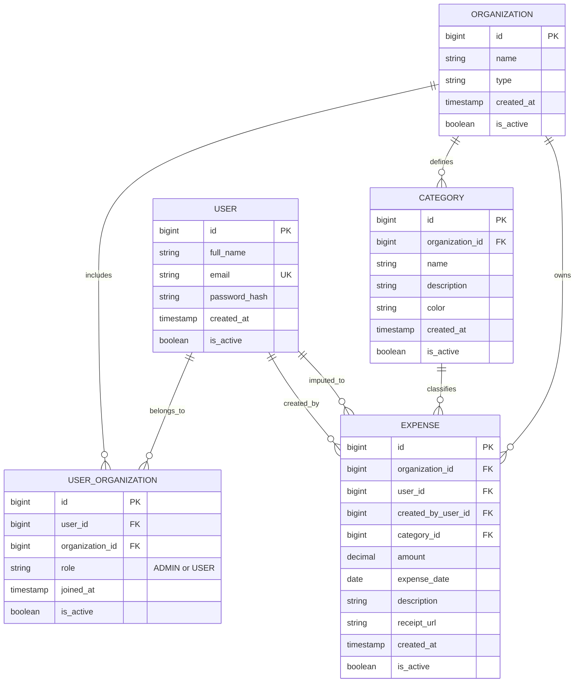

# 📊 Shareverance - Sistema de Gestión de Gastos Organizacionales

Sistema multi-tenant para la centralización, gestión y análisis predictivo de gastos aplicable a consorcios, universidades y hogares.

---

## 🛠️ Stack Tecnológico
* **Frontend:** React / TypeScript
* **Backend Transaccional:** Java (Spring Boot)
* **Microservicio Predictivo:** Python (FastAPI/Flask)
* **Base de Datos:** PostgreSQL

---

## 📐 Modelo de Datos (DER)

# Detalle de Entidades y Atributos

## 1. ORGANIZATION

Representa el grupo global o **tenant** del sistema (por ejemplo: consorcio, universidad o familia).

| Atributo | Tipo | Restricciones / Descripción |
|---|---|---|
| `id` | BIGINT | **PK**, Auto-increment. Identificador único. |
| `name` | VARCHAR(100) | Nombre de la entidad. Ej.: `"Edificio Av. Libertador 1234"`, `"Sede Central"`. |
| `type` | VARCHAR(50) | Clasificación del dominio: `HOUSEHOLD`, `CONDO`, `UNIVERSITY`. |
| `created_at` | TIMESTAMP | Fecha de alta de la organización. |
| `is_active` | BOOLEAN | Estado de la organización. `true` = activa, `false` = deshabilitada o dada de baja. Default: `true`. |

---

## 2. USER

Representa las **cuentas y credenciales globales** de los usuarios del sistema.

| Atributo | Tipo | Restricciones / Descripción |
|---|---|---|
| `id` | BIGINT | **PK**, Auto-increment. Identificador único. |
| `full_name` | VARCHAR(100) | Nombre completo o denominación de la unidad de gasto. |
| `email` | VARCHAR(150) | Correo único utilizado para autenticación mediante JWT. **Unique**. |
| `password_hash` | VARCHAR(255) | Hash seguro de la contraseña, utilizando BCrypt. |
| `created_at` | TIMESTAMP | Fecha de registro del usuario. |
| `is_active` | BOOLEAN | Estado del usuario en la plataforma. Default: `true`. |

---

## 3. USER_ORGANIZATION

Tabla intermedia que representa la relación **N:M** entre usuarios y organizaciones. Mapea la membresía y el rol de cada usuario dentro de una organización específica.

| Atributo | Tipo | Restricciones / Descripción |
|---|---|---|
| `id` | BIGINT | **PK**, Auto-increment. Identificador de la relación. |
| `user_id` | BIGINT | **FK → USER.id**. Clave foránea al usuario. |
| `organization_id` | BIGINT | **FK → ORGANIZATION.id**. Clave foránea a la organización. |
| `role` | VARCHAR(20) | Rol del usuario dentro de la organización: `ADMIN` o `USER`. |
| `joined_at` | TIMESTAMP | Fecha de ingreso del usuario al grupo. |
| `is_active` | BOOLEAN | Permite deshabilitar a un usuario dentro de una organización sin eliminar su cuenta global. Default: `true`. |

---

## 4. CATEGORY

Representa las **categorías de gastos configuradas por organización**.

| Atributo | Tipo | Restricciones / Descripción |
|---|---|---|
| `id` | BIGINT | **PK**, Auto-increment. Identificador de la categoría. |
| `organization_id` | BIGINT | **FK → ORGANIZATION.id**. Organización a la que pertenece. |
| `name` | VARCHAR(100) | Nombre de la categoría. Ej.: `"Sueldos"`, `"Supermercado"`, `"Insumos"`. |
| `description` | TEXT | Detalle opcional. **Nullable**. |
| `color` | VARCHAR(7) | Código hexadecimal utilizado para UI y tableros. Ej.: `#3B82F6`. |
| `created_at` | TIMESTAMP | Fecha de creación de la categoría. |
| `is_active` | BOOLEAN | Indica si la categoría está habilitada para nuevos registros. Default: `true`. |

---

## 5. EXPENSE

Entidad transaccional central. Representa los **egresos registrados en el sistema**.

| Atributo | Tipo | Restricciones / Descripción |
|---|---|---|
| `id` | BIGINT | **PK**, Auto-increment. Identificador del gasto. |
| `organization_id` | BIGINT | **FK → ORGANIZATION.id**. Tenant al que pertenece el gasto; facilita las consultas del microservicio de Python. |
| `user_id` | BIGINT | **FK → USER.id**. Usuario o unidad a quien se imputa el gasto. |
| `created_by_user_id` | BIGINT | **FK → USER.id**. Usuario que cargó físicamente el registro (Admin o el propio usuario). |
| `category_id` | BIGINT | **FK → CATEGORY.id**. Categoría vinculada al gasto. |
| `amount` | DECIMAL(12,2) | Monto monetario. |
| `expense_date` | DATE | Fecha en la que se realizó el gasto. |
| `description` | TEXT | Detalle o concepto del gasto. **Nullable**. |
| `receipt_url` | VARCHAR(255) | URL o path del comprobante. **Nullable**. |
| `created_at` | TIMESTAMP | Timestamp de creación del registro. |
| `is_active` | BOOLEAN | Indica si el gasto está vigente. `true` = vigente, `false` = anulado/deshabilitado. Default: `true`. |

---

## Relaciones principales

- **ORGANIZATION → USER_ORGANIZATION:** una organización puede tener múltiples usuarios.
- **USER → USER_ORGANIZATION:** un usuario puede pertenecer a múltiples organizaciones.
- **ORGANIZATION → CATEGORY:** una organización puede definir múltiples categorías de gastos.
- **ORGANIZATION → EXPENSE:** una organización puede contener múltiples gastos.
- **USER → EXPENSE:** un usuario puede tener múltiples gastos imputados.
- **USER → EXPENSE (`created_by_user_id`):** un usuario puede registrar múltiples gastos.
- **CATEGORY → EXPENSE:** una categoría puede estar asociada a múltiples gastos.
