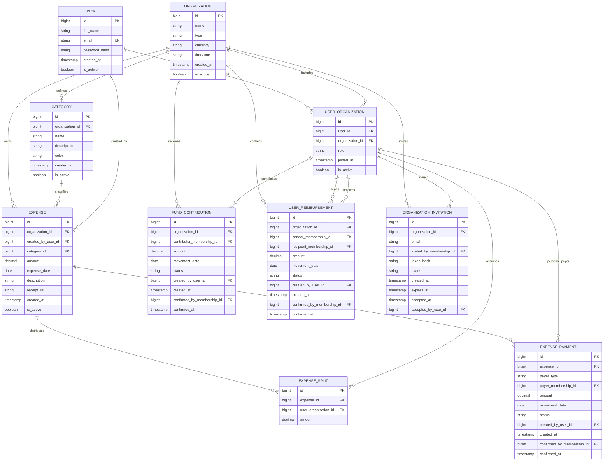

# 📊 Shareverance - Sistema de Gestión de Gastos Organizacionales

Sistema multi-tenant para la centralización, gestión y análisis predictivo de gastos aplicable a consorcios, universidades y hogares.

Actualización: 3 de octubre de 2026. Para el MVP, cada participante es un usuario miembro de la organización. Se contemplan repartos, aportes al fondo común, pagos directos y reintegros.

Las reglas, decisiones pendientes y observaciones post-MVP se documentan en [Reglas de negocio](REGLAS_DE_NEGOCIO.md). 

---

## 🛠️ Stack Tecnológico
* **Frontend:** React / TypeScript
* **Backend Transaccional:** Java (Spring Boot)
* **Microservicio Predictivo:** Python (FastAPI/Flask)
* **Base de Datos:** PostgreSQL

---

## 📐 Modelo de Datos (DER)

El DER muestra las relaciones de negocio principales.

# Detalle de Entidades y Atributos

## 1. ORGANIZATION

Representa el grupo global o **tenant** del sistema (por ejemplo: consorcio, universidad o familia).

| Atributo | Tipo | Restricciones / Descripción |
|---|---|---|
| `id` | BIGINT | **PK**, Auto-increment. Identificador único. |
| `name` | VARCHAR(100) | Nombre de la entidad. Ej.: `"Edificio Av. Libertador 1234"`, `"Sede Central"`. |
| `type` | VARCHAR(50) | Clasificación del dominio: `HOUSEHOLD`, `CONDO`, `UNIVERSITY`. |
| `currency` | CHAR(3) | Moneda única de la organización; inicial ARS. Cambiable solo sin gastos ni movimientos. |
| `timezone` | VARCHAR(100) | Zona para determinar el día actual; inicial America/Argentina/Buenos_Aires. |
| `created_at` | TIMESTAMP | Fecha de alta de la organización. |
| `is_active` | BOOLEAN | Estado de la organización. `true` = activa, `false` = deshabilitada o dada de baja. Default: `true`. |

---

## 2. USER

Representa las **cuentas y credenciales globales** de los usuarios del sistema.

| Atributo | Tipo | Restricciones / Descripción |
|---|---|---|
| `id` | BIGINT | **PK**, Auto-increment. Identificador único. |
| `full_name` | VARCHAR(100) | Nombre completo de la persona titular de la cuenta. La participación organizacional se representa en USER_ORGANIZATION. |
| `email` | VARCHAR(150) | Correo único utilizado para autenticación mediante JWT. **Unique**. |
| `password_hash` | VARCHAR(255) | Hash seguro de la contraseña, utilizando BCrypt. |
| `created_at` | TIMESTAMP | Fecha de registro del usuario. |
| `is_active` | BOOLEAN | Estado del usuario en la plataforma. Default: `true`. |

---

## 3. USER_ORGANIZATION

Tabla intermedia que representa la relación **N:M** entre usuarios y organizaciones. Mapea la membresía y el rol de cada usuario dentro de una organización específica.

| Atributo | Tipo | Restricciones / Descripción |
|---|---|---|
| `id` | BIGINT | **PK**, Auto-increment. Identificador de la relación. |
| `user_id` | BIGINT | **FK → USER.id**. Clave foránea al usuario. |
| `organization_id` | BIGINT | **FK → ORGANIZATION.id**. Clave foránea a la organización. |
| `role` | VARCHAR(20) | Rol del usuario dentro de la organización: `ADMIN` o `USER`. |
| `joined_at` | TIMESTAMP | Fecha de ingreso del usuario al grupo. |
| `is_active` | BOOLEAN | Permite deshabilitar a un usuario dentro de una organización sin eliminar su cuenta global. Default: `true`. Su desactivación conserva el historial y se bloquea si tiene saldo pendiente. |

**Restricción:** UNIQUE(user_id, organization_id). Roles por organización; no son roles globales.

---

## 4. CATEGORY

Representa las **categorías de gastos configuradas por organización**.

| Atributo | Tipo | Restricciones / Descripción |
|---|---|---|
| `id` | BIGINT | **PK**, Auto-increment. Identificador de la categoría. |
| `organization_id` | BIGINT | **FK → ORGANIZATION.id**. Organización a la que pertenece. |
| `name` | VARCHAR(100) | Nombre de la categoría. Ej.: `"Sueldos"`, `"Supermercado"`, `"Insumos"`. |
| `description` | TEXT | Detalle opcional. **Nullable**. |
| `color` | VARCHAR(7) | Código hexadecimal utilizado para UI y tableros. Ej.: `#3B82F6`. |
| `created_at` | TIMESTAMP | Fecha de creación de la categoría. |
| `is_active` | BOOLEAN | Indica si la categoría está habilitada para nuevos registros. Default: `true`. |

---

## 5. EXPENSE

Entidad transaccional central. Representa los **egresos registrados en el sistema**.

| Atributo | Tipo | Restricciones / Descripción |
|---|---|---|
| `id` | BIGINT | **PK**, Auto-increment. Identificador del gasto. |
| `organization_id` | BIGINT | **FK → ORGANIZATION.id**. Tenant al que pertenece el gasto. La categoría y los participantes deben pertenecer al mismo tenant. El acceso de Python queda pendiente de contrato. |
| `created_by_user_id` | BIGINT | **FK → USER.id**. Usuario que registró el gasto. No identifica necesariamente al pagador; los pagos se registran por separado. |
| `category_id` | BIGINT | **FK → CATEGORY.id**. Categoría vinculada al gasto. |
| `amount` | DECIMAL(12,2) | Monto monetario positivo, hasta 9.999.999.999,99; máximo dos decimales. |
| `expense_date` | DATE | Fecha del gasto, no futura. Admite antecedentes anteriores al alta de la organización. |
| `description` | TEXT | Detalle o concepto del gasto. **Nullable**. |
| `receipt_url` | VARCHAR(255) | URL o path del comprobante. **Nullable**. |
| `created_at` | TIMESTAMP | Timestamp de creación del registro. |
| `is_active` | BOOLEAN | Indica si el gasto está vigente. `true` = vigente, `false` = anulado/deshabilitado. Default: `true`. |

---

## 6. EXPENSE_SPLIT

Participación económica de cada miembro. Reemplaza la imputación única en EXPENSE. UNIQUE(expense_id, user_organization_id). No incluye un booleano paid: la liquidación requiere considerar movimientos. Modalidades de reparto y vinculación de liquidaciones por gasto pendientes de cierre.

| Atributo | Tipo | Restricciones / Descripción |
|---|---|---|
| `id` | BIGINT | PK, auto-increment. |
| `expense_id` | BIGINT | FK → EXPENSE.id. |
| `user_organization_id` | BIGINT | FK → USER_ORGANIZATION.id; participante de la misma organización. |
| `amount` | DECIMAL(12,2) | Parte positiva asignada. Suma de partes = total del gasto. |

---

## 7. FUND_CONTRIBUTION

Dinero entregado al fondo. Solo la confirmación por ADMIN aumenta caja y crédito individual.

| Atributo | Tipo | Restricciones / Descripción |
|---|---|---|
| `id` | BIGINT | PK, auto-increment. |
| `organization_id` | BIGINT | FK → ORGANIZATION.id. |
| `contributor_membership_id` | BIGINT | FK → USER_ORGANIZATION.id; titular del crédito. |
| `amount` | DECIMAL(12,2) | Aporte positivo, puede exceder la deuda. |
| `movement_date` | DATE | Desde el alta de la organización, no futura. |
| `status` | VARCHAR(20) | PENDING, CONFIRMED, REJECTED o CANCELLED. |
| `created_by_user_id` | BIGINT | FK → USER.id; autor del registro. |
| `created_at` | TIMESTAMP | Generado por servidor. |
| `confirmed_by_membership_id` | BIGINT | FK → USER_ORGANIZATION.id; ADMIN que confirma. Nullable. |
| `confirmed_at` | TIMESTAMP | Fecha de confirmación. Nullable. |

---

## 8. EXPENSE_PAYMENT

Dinero pagado al proveedor por un miembro o por el fondo. No crea otro gasto. Cada pago identifica obligatoriamente el origen del dinero. Un pago personal no exige aporte previo ni disponibilidad de caja y, al confirmarse, genera crédito al pagador sin modificar el fondo. Solo un pago desde el fondo requiere caja disponible y la reduce al confirmarse. La política de confirmación de pagos directos aún no fue acordada.

Un mismo gasto puede pagarse con ambos orígenes mediante registros separados. Los pagos confirmados más pendientes vigentes no pueden superar el total del gasto. No registrar además un aporte al fondo por el mismo dinero utilizado en un pago personal: duplicaría el crédito.

| Atributo | Tipo | Restricciones / Descripción |
|---|---|---|
| `id` | BIGINT | PK, auto-increment. |
| `expense_id` | BIGINT | FK → EXPENSE.id; determina organización y moneda. |
| `payer_type` | VARCHAR(10) | Origen obligatorio: USER = dinero personal; FUND = fondo común. Solo FUND requiere disponibilidad de caja. |
| `payer_membership_id` | BIGINT | FK → USER_ORGANIZATION.id; obligatorio para USER, nulo para FUND. |
| `amount` | DECIMAL(12,2) | Pago positivo; permite pagos parciales. Confirmados más pendientes vigentes no superan el gasto; solo FUND compromete caja. |
| `movement_date` | DATE | Desde el alta de la organización, no futura. |
| `status` | VARCHAR(20) | Estado propuesto; confirmación de pagos al proveedor pendiente de definición. |
| `created_by_user_id` | BIGINT | FK → USER.id; autor, distinto del pagador. |
| `created_at` | TIMESTAMP | Generado por servidor. |
| `confirmed_by_membership_id` | BIGINT | FK → USER_ORGANIZATION.id. Nullable; autoridad pendiente. |
| `confirmed_at` | TIMESTAMP | Nullable; según política de confirmación por definir. |

---

## 9. USER_REIMBURSEMENT

Dinero enviado de un miembro a otro para compensar saldos. El destinatario confirma. La vinculación con obligaciones concretas sigue pendiente; el MVP debe definirla antes de mostrar liquidación por gasto.

| Atributo | Tipo | Restricciones / Descripción |
|---|---|---|
| `id` | BIGINT | PK, auto-increment. |
| `organization_id` | BIGINT | FK → ORGANIZATION.id. |
| `sender_membership_id` | BIGINT | FK → USER_ORGANIZATION.id; emisor. |
| `recipient_membership_id` | BIGINT | FK → USER_ORGANIZATION.id; receptor distinto del emisor, misma organización. |
| `amount` | DECIMAL(12,2) | Reintegro positivo limitado por deuda y crédito disponibles. |
| `movement_date` | DATE | Desde el alta de la organización, no futura. |
| `status` | VARCHAR(20) | PENDING, CONFIRMED, REJECTED o CANCELLED. |
| `created_by_user_id` | BIGINT | FK → USER.id; autor. |
| `created_at` | TIMESTAMP | Generado por servidor. |
| `confirmed_by_membership_id` | BIGINT | FK → USER_ORGANIZATION.id; destinatario que confirma. Nullable. |
| `confirmed_at` | TIMESTAMP | Fecha de confirmación. Nullable. |

---

## 10. ORGANIZATION_INVITATION

Incorporación pendiente. Al aceptar, crea una membresía USER y marca la invitación ACCEPTED en una transacción. En MVP el ADMIN copia y comparte el enlace.

| Atributo | Tipo | Restricciones / Descripción |
|---|---|---|
| `id` | BIGINT | PK, auto-increment. |
| `organization_id` | BIGINT | FK → ORGANIZATION.id. |
| `email` | VARCHAR(150) | Email de la persona invitada; puede no tener cuenta. |
| `invited_by_membership_id` | BIGINT | FK → USER_ORGANIZATION.id; ADMIN activo de la organización. |
| `token_hash` | VARCHAR(255) | Hash del secreto del enlace; no guardar el secreto en texto plano. |
| `status` | VARCHAR(20) | PENDING, ACCEPTED, REVOKED o EXPIRED. |
| `created_at` | TIMESTAMP | Generado por servidor. |
| `expires_at` | TIMESTAMP | Siete días después de su creación. |
| `accepted_at` | TIMESTAMP | Nullable hasta aceptar. |
| `accepted_by_user_id` | BIGINT | FK → USER.id. Nullable hasta aceptar. |

---

## Relaciones principales

- **ORGANIZATION → USER_ORGANIZATION:** una organización puede tener múltiples miembros, cada uno con su rol.
- **USER → USER_ORGANIZATION:** un usuario puede pertenecer a múltiples organizaciones.
- **ORGANIZATION → CATEGORY:** una organización puede definir múltiples categorías de gastos.
- **ORGANIZATION → EXPENSE:** una organización puede contener múltiples gastos.
- **USER → EXPENSE (`created_by_user_id`):** un usuario puede registrar múltiples gastos, aunque no sea quien los paga.
- **CATEGORY → EXPENSE:** una categoría puede estar asociada a múltiples gastos.
- **EXPENSE → EXPENSE_SPLIT:** un gasto se distribuye en una o varias partes, cada una asignada a un miembro.
- **USER_ORGANIZATION → EXPENSE_SPLIT:** un miembro puede tener partes asignadas en múltiples gastos de su organización.
- **ORGANIZATION → FUND_CONTRIBUTION:** una organización puede recibir múltiples aportes a su fondo común.
- **USER_ORGANIZATION → FUND_CONTRIBUTION (`contributor_membership_id`):** un miembro puede realizar múltiples aportes al fondo; al confirmarse, generan crédito individual.
- **EXPENSE → EXPENSE_PAYMENT:** un gasto puede tener múltiples pagos parciales o completos, realizados con dinero personal o desde el fondo común.
- **USER_ORGANIZATION → EXPENSE_PAYMENT (`payer_membership_id`):** un miembro puede pagar múltiples gastos con dinero propio. Si el pago sale del fondo común, este campo queda vacío.
- **ORGANIZATION → USER_REIMBURSEMENT:** una organización puede registrar múltiples reintegros entre sus miembros.
- **USER_ORGANIZATION → USER_REIMBURSEMENT (`sender_membership_id`):** un miembro puede enviar múltiples reintegros a otros miembros.
- **USER_ORGANIZATION → USER_REIMBURSEMENT (`recipient_membership_id`):** un miembro puede recibir múltiples reintegros y confirmar su recepción.
- **ORGANIZATION → ORGANIZATION_INVITATION:** una organización puede tener múltiples invitaciones para incorporar miembros.
- **USER_ORGANIZATION → ORGANIZATION_INVITATION (`invited_by_membership_id`):** un miembro con rol ADMIN puede generar múltiples invitaciones para su organización.

Todos los participantes, categorías y movimientos vinculados deben pertenecer a la misma organización. El usuario que registra un gasto, quien lo paga y quienes asumen sus partes pueden ser personas diferentes.